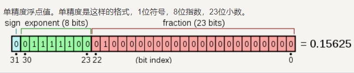
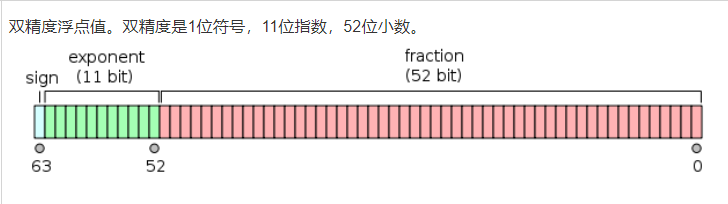
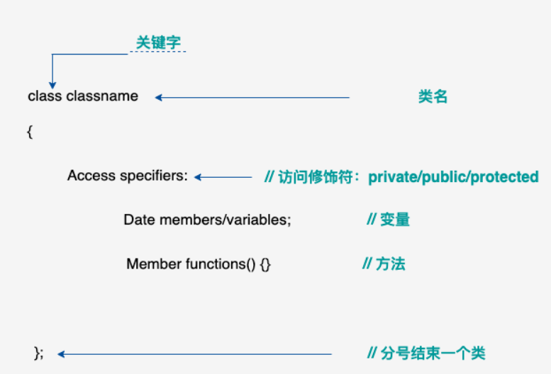
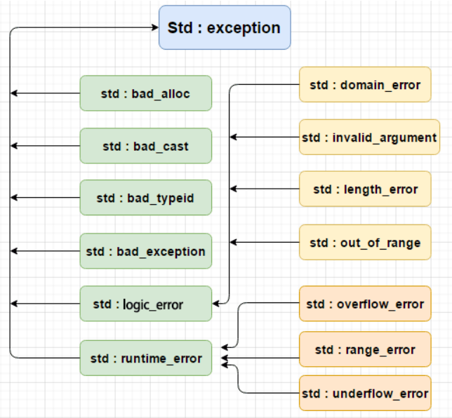

c++ 数据类型
===
首先声明一些基本类型可以使用一个或者多个类型修饰符：
|类型修饰符|备注|
|----|----|
|signed|有符号，数字类型（整型和浮点型）都可以用 signed 修饰，默认为有符号|
|unsigned|无符号，数字类型（整型和浮点型）都可以用 unsigned 修饰|
|short|(短整型，short interger),C++ 中的基本数据结构，用于表示短整数。|
|long|（长整型，long integer），C++ 中的基本数据结构，用于表示长整数。|
+ 注意：不同的系统各种变量类型占用内存可能不一致。
+ 注意：默认情况整型和浮点型都是带符号的（signed）
+ 注意：在加入了变量修饰符后，基本数据类型能表示的数据范围会改变。如 signed int （-128~127）而unsigned int （0~255）.

基本类型
---
| 类型 | 标识符 | 位 | 范围 |
| ---- | ---- | ---- | ---- |
| 布尔型 | bool | 4 byte | true 或 false |
| 字符型 | char | 1 byte|（signed -128 ~ 127） 或 （unsigned 0 ~ 255）|
| 整型 | int | 4 byte| (signed -2^32 ~ 2^32-1) 或 （unsigned 0 ~ 2^64-1）|
| 浮点型 | float | 4 byte | +/- 3.4e +/- 38 (~7 个数字) |
| 双浮点型 | double | 8 byte | +/- 1.7e +/- 308 (~15 个数字) |
| 无类型 | void |||
| 宽字符 | wchar_t | 2 或 4 byte | 1个宽字符 |

+ short int:2 byte
+ long int: 8 byte
+ long double: 16 byte 可提供18-19位有效数字。
```c++
#include<iostream>  
#include <limits>
 
using namespace std;  
  
int main()  
{  
    cout << "type: \t\t" << "************size**************"<< endl;  
    cout << "bool: \t\t" << "所占字节数：" << sizeof(bool);  
    cout << "\t最大值：" << (numeric_limits<bool>::max)();  
    cout << "\t\t最小值：" << (numeric_limits<bool>::min)() << endl;  
    cout << "char: \t\t" << "所占字节数：" << sizeof(char);  
    cout << "\t最大值：" << (numeric_limits<char>::max)();  
    cout << "\t\t最小值：" << (numeric_limits<char>::min)() << endl;  
    cout << "signed char: \t" << "所占字节数：" << sizeof(signed char);  
    cout << "\t最大值：" << (numeric_limits<signed char>::max)();  
    cout << "\t\t最小值：" << (numeric_limits<signed char>::min)() << endl;  
    cout << "unsigned char: \t" << "所占字节数：" << sizeof(unsigned char);  
    cout << "\t最大值：" << (numeric_limits<unsigned char>::max)();  
    cout << "\t\t最小值：" << (numeric_limits<unsigned char>::min)() << endl;  
    cout << "wchar_t: \t" << "所占字节数：" << sizeof(wchar_t);  
    cout << "\t最大值：" << (numeric_limits<wchar_t>::max)();  
    cout << "\t\t最小值：" << (numeric_limits<wchar_t>::min)() << endl;  
    cout << "short: \t\t" << "所占字节数：" << sizeof(short);  
    cout << "\t最大值：" << (numeric_limits<short>::max)();  
    cout << "\t\t最小值：" << (numeric_limits<short>::min)() << endl;  
    cout << "int: \t\t" << "所占字节数：" << sizeof(int);  
    cout << "\t最大值：" << (numeric_limits<int>::max)();  
    cout << "\t最小值：" << (numeric_limits<int>::min)() << endl;  
    cout << "unsigned: \t" << "所占字节数：" << sizeof(unsigned);  
    cout << "\t最大值：" << (numeric_limits<unsigned>::max)();  
    cout << "\t最小值：" << (numeric_limits<unsigned>::min)() << endl;  
    cout << "long: \t\t" << "所占字节数：" << sizeof(long);  
    cout << "\t最大值：" << (numeric_limits<long>::max)();  
    cout << "\t最小值：" << (numeric_limits<long>::min)() << endl;  
    cout << "unsigned long: \t" << "所占字节数：" << sizeof(unsigned long);  
    cout << "\t最大值：" << (numeric_limits<unsigned long>::max)();  
    cout << "\t最小值：" << (numeric_limits<unsigned long>::min)() << endl;  
    cout << "double: \t" << "所占字节数：" << sizeof(double);  
    cout << "\t最大值：" << (numeric_limits<double>::max)();  
    cout << "\t最小值：" << (numeric_limits<double>::min)() << endl;  
    cout << "long double: \t" << "所占字节数：" << sizeof(long double);  
    cout << "\t最大值：" << (numeric_limits<long double>::max)();  
    cout << "\t最小值：" << (numeric_limits<long double>::min)() << endl;  
    cout << "float: \t\t" << "所占字节数：" << sizeof(float);  
    cout << "\t最大值：" << (numeric_limits<float>::max)();  
    cout << "\t最小值：" << (numeric_limits<float>::min)() << endl;  
    cout << "size_t: \t" << "所占字节数：" << sizeof(size_t);  
    cout << "\t最大值：" << (numeric_limits<size_t>::max)();  
    cout << "\t最小值：" << (numeric_limits<size_t>::min)() << endl;  
    cout << "string: \t" << "所占字节数：" << sizeof(string) << endl;  
    // << "\t最大值：" << (numeric_limits<string>::max)() << "\t最小值：" << (numeric_limits<string>::min)() << endl;  
    cout << "type: \t\t" << "************size**************"<< endl;  
    return 0;  
}
```

typedef声明
---
为一个已有的数据类型取一个新的名字
```C++
typedef int newname;
newname flag;
```

枚举类型
---
是C++中的一种派生类型，它是由用户定义的若干枚举常量的集合。

如果一个变量只有几种可能的取值，可以定义为枚举类型。

枚举关键字为enum。一般形式为：
> enum 枚举名{
> 标识符[=整型常数]
> 标识符[=整型常数]
> ...
> 标识符[=整型常数]
> } 枚举变量；
```C++
//声明了一个动物的枚举
//但没有进行初始化（没有为每一个枚举赋值）
//默认是从 0 开始，依次加 1
enum anmial {cat, dog, pig,} a;
//a被赋值为cat
a=cat;
```
```C++
enum anmial {cat, dog=4, pig,} a;
//注意此时cat的值为0，dog的值为4，pig的值为5.
```

C++变量类型
===
+ 变量其实只不过是程序可操作的存储区的名称。C++ 中每个变量都有指定的类型，类型决定了变量存储的大小和布局，该范围内的值都可以存储在内存中，运算符可应用于变量上。
+ 变量的名称可以由字母、数字和下划线字符组成。它必须以字母或下划线开头。大写字母和小写字母是不同的，因为 **C++ 是大小写敏感**的。
+ C++ 也允许定义各种其他类型的变量，比如*___枚举、指针、数组、引用、数据结构、类___*等等

C++变量定义
---
+ 变量定义指定了一个数据类型，和包含一个或多个该变量类型的变量列表：

> type variable_list;
> 
> 在其中type必须是一个有效的数据类型或对象
> variable_list是一个或多个标识符组成，用','隔开，如下声明：
> 
> int i,j=5,k=3;
> char a;
> a='x';
> 其中在对变量赋值为其初始化操作（指定一个初始值）
>
> 不带初始化的定义：带有静态存储持续时间的变量会被隐式初始化为 NULL（所有字节的值都是 0），其他所有变量的初始值是未定义的。

C++变量声明
---
+ 变量声明向编译器保证变量以给定的类型和名称存在，这样编译器在不需要知道变量完整细节的情况下也能继续进一步的编译。变量声明只在编译时有它的意义，在程序连接时编译器需要实际的变量声明。

+ 当您使用多个文件且只在其中一个文件中定义变量时（定义变量的文件在程序连接时是可用的），变量声明就显得非常有用。您可以使用 extern 关键字在任何地方声明一个变量。虽然您可以在 C++ 程序中多次声明一个变量，但变量只能在某个文件、函数或代码块中被定义一次。
```C++
#include <iostream>
using namespace std;
//在这个实例中，变量在头部就已经被声明
//但它们是在主函数内被定义和初始化的

// 变量声明
extern int a, b;
extern int c;
extern float f;
  
int main ()
{
  // 变量定义
  int a, b;
  int c;
  float f;
 
  // 实际初始化
  a = 10;
  b = 20;
  c = a + b;
 
  cout << c << endl ;
 
  f = 70.0/3.0;
  cout << f << endl ;
 
  return 0;
}
```
```C++
//在函数声明时，提供一个函数名，而函数的实际定义则可以在任何地方进行。
// 函数声明
int func();
 
int main()
{
    // 函数调用
    int i = func();
}
 
// 函数定义
int func()
{
    return 0;
}
```
C++中的左值和右值
---
c++中两种类型的表达式：
+ **左值（lvalue）：** 指向内存位置的表达式被称为左值表达式。左值可以出现在等号的左边或右边
+ **右值（rvalue）：** 指的是存储在内存某些地址的数值，右值是不能对其赋值的表达式。右值只能出现在等式的右边

变量是左值，因此可以出现在赋值号的左边。数值型的字面值是右值，因此不能被赋值，不能出现在赋值号的左边。
```C++
int g=20;//g为变量是左值，出现在左边。20为右值出现在右边
int f=g;//g出现在右边
10=20;//10为右值出现在左边，报错
```
C++变量的作用域
===
作用域是程序的一个区域，一般来说有三个地方可以定义变量：
+ 在函数或一个代码块内部生命的变量，称为局部变量。
+ 在函数参数的定义中声明的变量称为形式参数。
+ 在所有函数外部声明的变量，称为全局变量。

局部变量
---
```C++
#include <iostream>
using namespace std;
//局部变量。它们只能被函数内部或者代码块内部的语句使用
int main ()
{
  // 局部变量声明
  int a, b;
  int c;
 
  // 实际初始化
  a = 10;
  b = 20;
  c = a + b;
 
  cout << c;
 
  return 0;
}
```
全局变量
---
```C++
#include <iostream>
using namespace std;
//全局变量的值在程序的整个生命周期内都是有效的。
//全局变量可以被任何函数访问。也就是说，全局变量一旦声明，在整个程序中都是可用的。
// 全局变量声明
int g;
 
int main ()
{
  // 局部变量声明
  int a, b;
 
  // 实际初始化
  a = 10;
  b = 20;
  g = a + b;
 
  cout << g;
 
  return 0;
}
```
初始化全局变量和局部变量
---
定义全局变量时，系统会自动初始化为以下默认值
|数据类型|初始化默认值|
|----|----|
| int | 0 |
| char | '\0' |
| float | 0 |
| double | 0 |
| pointer | NULL |

C++常量
===
常量是固定值，在程序执行期间不会改变，也叫做字面量。
常量可以是任何的基本数据类型（整型、浮点数、字符、字符串、布尔值）。
常量的值在定义后无法修改。

整数常量
---
+ 可以是八进制（0），十进制（默认），十六进制（0x或0X）
+ 整数常量也可以点后缀，U（u）代表无符号整数，L（l）代表长整数。ul顺序任意

> 212         // 合法的
215u        // 合法的
0xFeeL      // 合法的
078         // 非法的：8 不是八进制的数字
032UU       // 非法的：不能重复后缀
85         // 十进制
0213       // 八进制 
0x4b       // 十六进制 
30         // 整数 
30u        // 无符号整数 
30l        // 长整数 
30ul       // 无符号长整数

浮点常量
---
+ 浮点常量由整数部分，小数部分，和指数部分组成。可以用小数形式或者指数形式来表示浮点常量
+ 小数形式必须包含整数和小数部分
+ 指数形式必须包含小数点，指数，带符号的指数使用e(E)来引入的。

> 3.14159       // 合法的 
314159E-5L    // 合法的 
510E          // 非法的：不完整的指数
210f          // 非法的：没有小数或指数
.e55          // 非法的：缺少整数或分数

布尔常量
---
+ **true代表真**
+ **false代表假**
+ **注意：不应该把true的值看为1，false的值看为0**

字符常量
---
字符常量是括在单引号中的。如果常量是以L开头时，表示是一个宽字符常量，必须存储在wchar_t类型的变量中反之则是一个窄字符常量，可以存储在char类型的变量中。
字符常量可以是一个简单的字符，转义字符，或者一个通用字符。
一些特定字符加上了反斜杠就有了特定的含义
|转义序列|含义|
|----|----|
|\\\\|\\字符|
|\\'|'字符|
|\\''|''字符|
|\\?|?字符|
|\\a|警报铃声|
|\\b|退格键|
|\\f|换页符|
|\\n|换行符|
|\\r|回车|
|\\t|水平制表符|
|\\v|垂直制表符|
|\\ooo|一到三位的八进制数|
|\\xhh...|一个或多个数字的十六进制数|

字符串常量
---
+ 使用双引号包括
+ 包含类似于字符常量的字符：字符，转义序列，通用字符
+ 可以使用 \ 作为分隔符将字符串分行

定义常量
---
+ **使用#define**预处理器
+ 使用**const**关键字
+ **常量名大写**

C++修饰符类型
---
+ **signed**
+ **unsigned**
+ **long**
+ **short**

```C++
#include <iostream>
using namespace std;
 
/* 
 * 这个程序演示了有符号整数和无符号整数之间的差别
*/
int main()
{
   short int i;           // 有符号短整数
   short unsigned int j;  // 无符号短整数
 
   j = 50000;
 
   i = j;
   cout << i << " " << j;
   //结果为i是-15536，j为50000

   return 0;
}
```

C++类型限定符
---
|限定符|含义|
|----|----|
|const|const 类型的对象在程序执行期间不能被修改改变。|
|volatile|修饰符 volatile 告诉编译器不需要优化volatile声明的变量，让程序可以直接从内存中读取变量。对于一般的变量编译器会对变量进行优化，将内存中的变量值放在寄存器中以加快读写效率。|
|restrict|由 restrict 修饰的指针是唯一一种访问它所指向的对象的方式。只有 C99 增加了新的类型限定符 restrict。|

C++存储类
===
存储类定义 C++ 程序中变量/函数的范围（可见性）和生命周期。这些说明符放置在它们所修饰的类型之前。下面列出 C++ 程序中可用的存储类：
+ **auto**
+ **register**
+ **static**
+ **extern**
+ **mutable**
+ **thread_local（C++11）**

从 C++ 17 开始，auto 关键字不再是 C++ 存储类说明符，且 register 关键字被弃用。

auto存储类
---
自 C++ 11 以来，auto 关键字用于两种情况：声明变量时根据初始化表达式自动推断该变量的类型、声明函数时函数返回值的占位符。
> auto f=3.14;      //double
auto s("hello");  //const char*
auto z = new auto(9); // int*
auto x1 = 5, x2 = 5.0, x3='r';//错误，必须是初始化为同一类型

register存储类
---
register 存储类用于定义存储在寄存器中而不是 RAM 中的局部变量。这意味着变量的最大尺寸等于寄存器的大小（通常是一个词），且不能对它应用一元的 '&' 运算符（因为它没有内存位置）。
> {
   register int  miles;
}

static存储类
---
static 存储类指示编译器在程序的生命周期内保持局部变量的存在，而不需要在每次它进入和离开作用域时进行创建和销毁。因此，使用 static 修饰局部变量可以在函数调用之间保持局部变量的值。

static 修饰符也可以应用于全局变量。当 static 修饰全局变量时，会使变量的作用域限制在声明它的文件内。

在 C++ 中，当 static 用在类数据成员上时，会导致仅有一个该成员的副本被类的所有对象共享

extern存储类
---
extern 存储类用于提供一个全局变量的引用，全局变量对所有的程序文件都是可见的。当您使用 'extern' 时，对于无法初始化的变量，会把变量名指向一个之前定义过的存储位置。

当您有多个文件且定义了一个可以在其他文件中使用的全局变量或函数时，可以在其他文件中使用 extern 来得到已定义的变量或函数的引用。可以这么理解，extern 是用来在另一个文件中声明一个全局变量或函数。

mutable存储类
---
mutable 说明符仅适用于类的对象，它允许对象的成员替代常量。也就是说，mutable 成员可以通过 const 成员函数修改。

thread_local存储类
---
使用 thread_local 说明符声明的变量仅可在它在其上创建的线程上访问。 变量在创建线程时创建，并在销毁线程时销毁。 每个线程都有其自己的变量副本。

thread_local 说明符可以与 static 或 extern 合并。

可以将 thread_local 仅应用于数据声明和定义，thread_local 不能用于函数声明或定义。
可以被声明为thread_local的变量
+ 命名空间下的全局变量
+ 类的static成员变量
+ 本地局部变量
+ 文件静态变量

```C++
thread_local int x;  // 命名空间下的全局变量
class X
{
    static thread_local std::string s; // 类的static成员变量
};
static thread_local std::string X::s;  // X::s 是需要定义的
 
void foo()
{
    thread_local std::vector<int> v;  // 本地变量
}
```
C++运算符
===
C++内置丰富运算符并提供了以下类型的运算符：
+ 算术运算符
+ 关系运算符
+ 逻辑运算符
+ 位运算符
+ 赋值运算符
+ 其他运算符

算术运算符
---
包含+、-、*、/、%（取模余数）、++（自增）、--（自减）

关系运算符
---
检查两个操作数的值是否相等，满足运算符则为真。
\==(等于)、!=（不等）、>(大于)、<（小于）、<=（小于等于）、>=（大于等于）

逻辑运算符
---
与（&&）、或（||）、非（！用于逆转操作数的逻辑状态）

位运算符
---
位运算符作用于位，并逐位执行操作。&、 | 和 ^(异或) 的真值表如下所示：
|P|Q|P&Q|P\|Q|P^Q|
|----|----|----|----|---|
|0|0|0|0|0|
|0|1|0|1|1|
|1|1|1|1|0|
|1|0|0|1|1|

除此之外还有~（非）、<<(左移运算符)、>>（右移运算符）。
```C++
#include <iostream>
using namespace std;
 
int main()
{
   unsigned int a = 60;      // 60 = 0011 1100  
   unsigned int b = 13;      // 13 = 0000 1101
   int c = 0;           
 
   c = a & b;             // 12 = 0000 1100
   cout << "Line 1 - c 的值是 " << c << endl ;
 
   c = a | b;             // 61 = 0011 1101
   cout << "Line 2 - c 的值是 " << c << endl ;
 
   c = a ^ b;             // 49 = 0011 0001
   cout << "Line 3 - c 的值是 " << c << endl ;
 
   c = ~a;                // -61 = 1100 0011
   cout << "Line 4 - c 的值是 " << c << endl ;
 
   c = a << 2;            // 240 = 1111 0000
   cout << "Line 5 - c 的值是 " << c << endl ;
 
   c = a >> 2;            // 15 = 0000 1111
   cout << "Line 6 - c 的值是 " << c << endl ;
 
   return 0;
}
```
赋值运算符
---
=、+=、-=、*=、/=、%=、<<=、>>=、&=、^=、|=。

杂项运算符
---
|运算符|描述|
|-|-|
|sizeof|	sizeof 运算符返回变量的大小。例如，sizeof(a) 将返回 4，其中 a 是整数|
|,|逗号运算符会顺序执行一系列运算。整个逗号表达式的值是以逗号分隔的列表中的最后一个表达式的值|
|Condition？x：y|条件运算符。如果 Condition 为真 ? 则值为 X : 否则值为 Y|
|. and ->|成员运算符用于引用类、结构和共用体的成员|
|Cast|强制转换运算符把一种数据类型转换为另一种数据类型。例如，int(2.2000) 将返回 2|
|&|指针运算符 & 返回变量的地址。例如 &a; 将给出变量的实际地址|
|* |指针运算符 * 指向一个变量。例如，*var; 将指向变量 var|

C++运算符优先级
---
|类别 |	运算符 |	结合性|
|-|-|-| 
|后缀 |	() [] -> . ++ - - | 	从左到右 |
|一元 |	+ - ! ~ ++ - - (type)* & sizeof |	从右到左| 
|乘除 |	* / % |	从左到右 |
|加减 |	+ - |	从左到右 |
|移位 |	<< >> 	|从左到右 |
|关系 |	< <= > >= |	从左到右 |
|相等 |	== != |	从左到右 |
|位与 AND |	& |	从左到右 |
|位异或 XOR |	^ |	从左到右 |
|位或 OR |	\| |	从左到右 |
|逻辑与 AND |	&& |	从左到右 |
|逻辑或 OR |	\|\| |	从左到右 |
|条件 |	?: |	从右到左 |
|赋值 |	= += -= *= /= %=>>= <<= &= ^= \|= 	|从右到左 |
|逗号 |	, |	从左到右 |

C++循环
===
for(){}、while(){}、do{}while()

C++判断
---
if、if（）{}else{}、switch

C++函数
===
函数声明告诉编译器函数的名称、返回类型和参数。函数定义提供了函数的实际主体。

定义函数
---
+ 返回类型
+ 函数名称
+ 参数
+ 函数主体

函数声明
---
函数声明会告诉编译器函数名称及如何调用函数。函数的实际主体可以单独定义。
> int max(int num1, int num2);
> 
> int max(int, int);
> 
> 当您在一个源文件中定义函数且在另一个文件中调用函数时，函数声明是必需的。在这种情况下，您应该在调用函数的文件顶部声明函数。

函数调用
---
创建 C++ 函数时，会定义函数做什么，然后通过调用函数来完成已定义的任务。

当程序调用函数时，程序控制权会转移给被调用的函数。被调用的函数执行已定义的任务，当函数的返回语句被执行时，或到达函数的结束括号时，会把程序控制权交还给主程序。

调用函数时，传递所需参数，如果函数返回一个值，则可以存储返回值。例如：
```C++
#include <iostream>
using namespace std;
 
// 函数声明
int max(int num1, int num2);
 
int main ()
{
   // 局部变量声明
   int a = 100;
   int b = 200;
   int ret;
 
   // 调用函数来获取最大值
   ret = max(a, b);
 
   cout << "Max value is : " << ret << endl;
 
   return 0;
}
 
// 函数返回两个数中较大的那个数
int max(int num1, int num2) 
{
   // 局部变量声明
   int result;
 
   if (num1 > num2)
      result = num1;
   else
      result = num2;
 
   return result; 
}
```

函数参数
---
如果函数要使用参数，则必须声明接受参数值的变量。这些变量称为函数的形式参数。

形式参数就像函数内的其他局部变量，在进入函数时被创建，退出函数时被销毁。

当调用函数时，有三种向函数传递参数的方式：
|调用类型	|描述|
|-|-|
|传值调用|	该方法把参数的实际值赋值给函数的形式参数。在这种情况下，修改函数内的形式参数对实际参数没有影响。|
|指针调用	|该方法把参数的地址赋值给形式参数。在函数内，该地址用于访问调用中要用到的实际参数。这意味着，修改形式参数会影响实际参数。|
|引用调用|	该方法把参数的引用赋值给形式参数。在函数内，该引用用于访问调用中要用到的实际参数。这意味着，修改形式参数会影响实际参数。|

参数的默认值
---
定义一个函数，您可以为参数列表中后边的每一个参数指定默认值。当调用函数时，如果实际参数的值留空，则使用这个默认值。如果指定了值，则会忽略默认值，使用传递的值。

Lambda函数与表达式
---
C++11 提供了对匿名函数的支持,称为 Lambda 函数(也叫 Lambda 表达式)。

Lambda 表达式把函数看作对象。Lambda 表达式可以像对象一样使用，比如可以将它们赋给变量和作为参数传递，还可以像函数一样对其求值。

Lambda 表达式本质上与函数声明非常类似。Lambda 表达式具体形式如下:
> [capture]\(parameters)->return-type{body}
> 如果没有返回值可以表示为：
> [capture]\(parameters){body}

在Lambda表达式内可以访问当前作用域的变量，这是Lambda表达式的闭包（Closure）行为。 与JavaScript闭包不同，C++变量传递有传值和传引用的区别。可以通过前面的[]来指定：
> []      // 沒有定义任何变量。使用未定义变量会引发错误。
[x, &y] // x以传值方式传入（默认），y以引用方式传入。
[&]     // 任何被使用到的外部变量都隐式地以引用方式加以引用。
[=]     // 任何被使用到的外部变量都隐式地以传值方式加以引用。
[&, x]  // x显式地以传值方式加以引用。其余变量以引用方式加以引用。
[=, &z] // z显式地以引用方式加以引用。其余变量以传值方式加以引用。
另外有一点需要注意。对于[=]或[&]的形式，lambda 表达式可以直接使用 this 指针。但是，对于[]的形式，如果要使用 this 指针，必须显式传入：
[this]\() { this->someFunc(); }();

C++数字
===
使用基本数据类型来定义数字。

C++数字运算
---
> double log(double);
该函数返回参数的自然对数。
>	double pow(double, double);
假设第一个参数为 x，第二个参数为 y，则该函数返回 x 的 y 次方。
> int abs(int);
该函数返回整数的绝对值。
> double fabs(double);
该函数返回任意一个浮点数的绝对值。
> double floor(double);
该函数返回一个小于或等于传入参数的最大整数。

C++随机数
---
在许多情况下，需要生成随机数。关于随机数生成器，有两个相关的函数。一个是 rand()，该函数只返回一个伪随机数。生成随机数之前必须先调用 srand() 函数。
```C++
#include <iostream>
#include <ctime>
#include <cstdlib>
 
using namespace std;
 
int main ()
{
   int i,j;
 
   // 设置种子
   srand( (unsigned)time( NULL ) );
 
   /* 生成 10 个随机数 */
   for( i = 0; i < 10; i++ )
   {
      // 生成实际的随机数
      j= rand();
      cout <<"随机数： " << j << endl;
   }
 
   return 0;
}
```
C++数组
===
声明数组
---
> 在 C++ 中要声明一个数组，需要指定元素的类型和元素的数量，如下所示：
type arrayName [ arraySize ];

初始化数组
---

> 在 C++ 中，您可以逐个初始化数组，也可以使用一个初始化语句，如下所示：
double balance[5] = {1000.0, 2.0, 3.4, 7.0, 50.0};
大括号 { } 之间的值的数目不能大于我们在数组声明时在方括号 [ ] 中指定的元素数目。

> 如果您省略掉了数组的大小，数组的大小则为初始化时元素的个数。因此，如果：
double balance[] = {1000.0, 2.0, 3.4, 7.0, 50.0};

C++数组详解
---
|概念	|描述|
|-|-|
|多维数组|	C++ 支持多维数组。多维数组最简单的形式是二维数组。|
|指向数组的指针|	您可以通过指定不带索引的数组名称来生成一个指向数组中第一个元素的指针。|
|传递数组给函数|	您可以通过指定不带索引的数组名称来给函数传递一个指向数组的指针。|
|从函数返回数组	|C++ 允许从函数返回数组。|

C++字符串
===
字符串实际上是使用 null 字符 \0 终止的一维字符数组。因此，一个以 null 结尾的字符串，包含了组成字符串的字符。
C++ 中有大量的函数用来操作以 null 结尾的字符串:
|序号	|函数 & 目的|
|-|-|
|1	|strcpy(s1, s2);复制字符串 s2 到字符串 s1。|
|2|	strcat(s1, s2);连接字符串 s2 到字符串 s1 的末尾。连接字符串也可以用 + 号，例如:string str1 = "runoob";string str2 = "google";string str = str1 + str2;|
|3|	strlen(s1);返回字符串 s1 的长度。|
|4	|strcmp(s1, s2);如果 s1 和 s2 是相同的，则返回 0；如果 s1<s2 则返回值小于 0；如果 s1>s2 则返回值大于 0。|
|5	|strchr(s1, ch);返回一个指针，指向字符串 s1 中字符 ch 的第一次出现的位置。|
|6	|strstr(s1, s2);返回一个指针，指向字符串 s1 中字符串 s2 的第一次出现的位置。|

C++string类
---
C++指针
===
通过指针，可以简化一些 C++ 编程任务的执行，还有一些任务，如动态内存分配，没有指针是无法执行的。每一个变量都有一个内存位置，每一个内存位置都定义了可使用连字号（&）运算符访问的地址，它表示了在内存中的一个地址。
```C++
#include <iostream>
 
using namespace std;
 
int main ()
{
   int  var1;
   char var2[10];
 
   cout << "var1 变量的地址： ";
   cout << &var1 << endl;
 
   cout << "var2 变量的地址： ";
   cout << &var2 << endl;
 
   return 0;
}
```  
什么是指针？
---
指针是一个变量，其值为另一个变量的地址，即，内存位置的直接地址。就像其他变量或常量一样，您必须在使用指针存储其他变量地址之前，对其进行声明。指针变量声明的一般形式为：
> type *var-name;

指针详解
---
|概念|描述|
|-|-|
|C++ Null 指针	|C++ 支持空指针。NULL 指针是一个定义在标准库中的值为零的常量。|
|C++ 指针的算术运算	|可以对指针进行四种算术运算：++、--、+、-|
|C++ 指针 vs 数组	|指针和数组之间有着密切的关系。|
|C++ 指针数组	|可以定义用来存储指针的数组。|
|C++ 指向指针的指针|	C++ 允许指向指针的指针。|
|C++ 传递指针给函数	|通过引用或地址传递参数，使传递的参数在调用函数中被改变。|
|C++ 从函数返回指针|	**C++ 允许函数返回指针到局部变量、静态变量和动态内存分配**|

C++引用
===
引用变量是一个别名，也就是说，它是某个已存在变量的另一个名字。**一旦把引用初始化为某个变量，就可以使用该引用名称或变量名称来指向变量。**

C++引用vs指针
---
+ 不存在空引用，引用必须链接到一块合法的内存
+ 一旦引用被初始化为一个对象，就不能指向另一个对象。指针在任何时候都可以指向另一个对象
+ 引用必须在创建时初始化，指针可以在任何时候被初始化

|概念|	描述|
|-|-|
|把引用作为参数|	C++ 支持把引用作为参数传给函数，这比传一般的参数更安全。|
|把引用作为返回值	|可以从 C++ 函数中返回引用，就像返回其他数据类型一样。|

C++把引用作为返回值
---
通过使用引用来替代指针，会使 C++ 程序更容易阅读和维护。C++ 函数可以返回一个引用，方式与返回一个指针类似。

当函数返回一个引用时，则返回一个指向返回值的隐式指针。这样，函数就可以放在赋值语句的左边。
```C++
#include <iostream>
 
using namespace std;
 
double vals[] = {10.1, 12.6, 33.1, 24.1, 50.0};
 
double& setValues(int i) {  
   double& ref = vals[i];    
   return ref;   // 返回第 i 个元素的引用，ref 是一个引用变量，ref 引用 vals[i]
 
 
}
 
// 要调用上面定义函数的主函数
int main ()
{
 
   cout << "改变前的值" << endl;
   for ( int i = 0; i < 5; i++ )
   {
       cout << "vals[" << i << "] = ";
       cout << vals[i] << endl;
   }
 
   setValues(1) = 20.23; // 改变第 2 个元素
   setValues(3) = 70.8;  // 改变第 4 个元素
 
   cout << "改变后的值" << endl;
   for ( int i = 0; i < 5; i++ )
   {
       cout << "vals[" << i << "] = ";
       cout << vals[i] << endl;
   }
   return 0;
}
```

**注意**：当返回一个引用时，要注意被引用的对象不能超出作用域。所以返回一个对局部变量的引用是不合法的，但是，可以返回一个对静态变量的引用。

```C++
int& func() {
   int q;
   //! return q; // 在编译时发生错误
   static int x;
   return x;     // 安全，x 在函数作用域外依然是有效的
}
```

C++的基本输入输出
===
C++ 的 I/O 发生在流中，流是字节序列。如果字节流是从设备（如键盘、磁盘驱动器、网络连接等）流向内存，这叫做**输入操作**。如果字节流是从内存流向设备（如显示屏、打印机、磁盘驱动器、网络连接等），这叫做**输出操作**。

I/O库头文件
---
|头文件|	函数和描述|
|-|-|
|\<iostream>	|该文件定义了 cin、cout、cerr 和 clog 对象，分别对应于标准输入流、标准输出流、非缓冲标准错误流和缓冲标准错误流。|
|\<iomanip>|	该文件通过所谓的参数化的流操纵器（比如 setw 和 setprecision），来声明对执行标准化 I/O 有用的服务。|
|\<fstream>	|该文件为用户控制的文件处理声明服务。我们将在文件和流的相关章节讨论它的细节。|

标准输出流
--
预定义的对象 cout 是 iostream 类的一个实例。cout 对象"连接"到标准输出设备，通常是显示屏。cout 是与流插入运算符 << 结合使用的
C++ 编译器根据要输出变量的数据类型，选择合适的流插入运算符来显示值。<< 运算符被重载来输出内置类型（整型、浮点型、double 型、字符串和指针）的数据项。

流插入运算符 << 在一个语句中可以多次使用

标准输入流
---
预定义的对象 cin 是 iostream 类的一个实例。cin 对象附属到标准输入设备，通常是键盘。cin 是与流提取运算符 >> 结合使用的
C++ 编译器根据要输入值的数据类型，选择合适的流提取运算符来提取值，并把它存储在给定的变量中。

流提取运算符 >> 在一个语句中可以多次使用，如果要求输入多个数据，可以使用如下语句：

> cin >> name >> age;

标准错误流
---
预定义的对象 cerr 是 iostream 类的一个实例。cerr 对象附属到标准输出设备，通常也是显示屏，但是 cerr 对象是非缓冲的，且每个流插入到 cerr 都会立即输出。

cerr 也是与流插入运算符 << 结合使用的

标准日志流
---
预定义的对象 clog 是 iostream 类的一个实例。clog 对象附属到标准输出设备，通常也是显示屏，但是 clog 对象是缓冲的。这意味着每个流插入到 clog 都会先存储在缓冲区，直到缓冲填满或者缓冲区刷新时才会输出。

clog 也是与流插入运算符 << 结合使用的

C++类和对象
===
类用于指定对象的形式，它包含了数据表示法和用于处理数据的方法。类中的数据和方法称为类的成员。函数在一个类中被称为类的成员。

C++类定义
---
定义一个类，本质上是定义一个数据类型的蓝图。这实际上并没有定义任何数据，但它定义了类的名称意味着什么，也就是说，它定义了类的对象包括了什么，以及可以在这个对象上执行哪些操作。


定义C++对象
---
```C++
class Box
{
   public:
      double length;   // 盒子的长度
      double breadth;  // 盒子的宽度
      double height;   // 盒子的高度
};
int main(){
   Box Box1;          // 声明 Box1，类型为 Box
   Box Box2;          // 声明 Box2，类型为 Box
}
```
访问数据成员
---
使用点号操作符如：Box1.length。对于私有成员使用类内定义成员函数获取。

类和对象详解
---
|概念	|描述|
|-|-|
|类成员函数	|类的成员函数是指那些把定义和原型写在类定义内部的函数，就像类定义中的其他变量一样。
|类访问修饰符	|类成员可以被定义为 public、private 或 protected。默认情况下是定义为 private。|
|构造函数 & 析构函数	|类的构造函数是一种特殊的函数，在创建一个新的对象时调用。类的析构函数也是一种特殊的函数，在删除所创建的对象时调用。|
|C++ 拷贝构造函数	|拷贝构造函数，是一种特殊的构造函数，它在创建对象时，是使用同一类中之前创建的对象来初始化新创建的对象。如果在类中没有定义拷贝构造函数，编译器会自行定义一个。如果类带有指针变量，并有动态内存分配，则它必须有一个拷贝构造函数。|
|C++ 友元函数	|友元函数可以访问类的 private 和 protected 成员。|
|C++ 内联函数|	通过内联函数，编译器试图在调用函数的地方扩展函数体中的代码。|
|C++ 中的 this 指针	|每个对象都有一个特殊的指针 this，它指向对象本身。|
|C++ 中指向类的指针	|指向类的指针方式如同指向结构的指针。实际上，类可以看成是一个带有函数的结构。
C++ 类的静态成员	|类的数据成员和函数成员都可以被声明为静态的。|

C++继承
===
继承允许我们依据另一个类来定义一个类，这使得创建和维护一个应用程序变得更容易。这样做，也达到了重用代码功能和提高执行效率的效果。

当创建一个类时，您不需要重新编写新的数据成员和成员函数，只需指定新建的类继承了一个已有的类的成员即可。这个已有的类称为基类，新建的类称为派生类。

基类和派生
---
一个类可以派生自多个类，这意味着，它可以从多个基类继承数据和函数。定义一个派生类，我们使用一个类派生列表来指定基类。类派生列表以一个或多个基类命名，形式如下：

> class derived-class: access-specifier base-class
> 其中，访问修饰符 access-specifier 是 public、protected 或 private 其中的一个，base-class 是之前定义过的某个类的名称。如果未使用访问修饰符 access-specifier，则默认为 private。

访问控制和继承
---
|访问|	public|	protected|	private|
|-|-|-|-|
|同一个类|	yes|	yes	|yes|
|派生类	|yes	|yes|	no|
|外部的类	|yes|	no|	no|

一个派生类继承了所有的基类方法，但下列情况除外：
+ 基类的构造函数、析构函数和拷贝构造函数。
+ 基类的重载运算符。
+ 基类的友元函数。

继承类型
---
当一个类派生自基类，该基类可以被继承为 public、protected 或 private 几种类型。继承类型是通过上面讲解的访问修饰符 access-specifier 来指定的。

我们几乎不使用 protected 或 private 继承，通常使用 public 继承。当使用不同类型的继承时，遵循以下几个规则：

+ **公有继承（public）**：当一个类派生自公有基类时，基类的公有成员也是派生类的公有成员，基类的保护成员也是派生类的保护成员，基类的私有成员不能直接被派生类访问，但是可以通过调用基类的公有和保护成员来访问。
+ **保护继承（protected）**： 当一个类派生自保护基类时，基类的公有和保护成员将成为派生类的保护成员。
+ **私有继承（private）**：当一个类派生自私有基类时，基类的公有和保护成员将成为派生类的私有成员。

多继承
---
多继承即一个子类可以有多个父类，它继承了多个父类的特性。

C++ 类可以从多个类继承成员，语法如下：

> class <派生类名>:<继承方式1><基类名1>,<继承方式2><基类名2>,…
{
<派生类类体>
};

C++重载运算符和重载函数
---
C++ 允许在同一作用域中的某个函数和运算符指定多个定义，分别称为函数重载和运算符重载。重载声明是指一个与之前已经在该作用域内声明过的函数或方法具有相同名称的声明，但是它们的参数列表和定义（实现）不相同。

当您调用一个重载函数或重载运算符时，编译器通过把您所使用的参数类型与定义中的参数类型进行比较，决定选用最合适的定义。选择最合适的重载函数或重载运算符的过程，称为重载决策。

C++重载函数
---
在同一个作用域内，可以声明几个功能类似的同名函数，但是这些同名函数的形式参数（指参数的个数、类型或者顺序）必须不同。

C++重载运算符
---
重载的运算符是带有特殊名称的函数，函数名是由关键字 operator 和其后要重载的运算符符号构成的。与其他函数一样，重载运算符有一个返回类型和一个参数列表。

```C++
#include <iostream>
using namespace std;
 
class Box
{
   public:
 
      double getVolume(void)
      {
         return length * breadth * height;
      }
      void setLength( double len )
      {
          length = len;
      }
 
      void setBreadth( double bre )
      {
          breadth = bre;
      }
 
      void setHeight( double hei )
      {
          height = hei;
      }
      // 重载 + 运算符，用于把两个 Box 对象相加
      Box operator+(const Box& b)
      {
         Box box;
         box.length = this->length + b.length;
         box.breadth = this->breadth + b.breadth;
         box.height = this->height + b.height;
         return box;
      }
   private:
      double length;      // 长度
      double breadth;     // 宽度
      double height;      // 高度
};
// 程序的主函数
int main( )
{
   Box Box1;                // 声明 Box1，类型为 Box
   Box Box2;                // 声明 Box2，类型为 Box
   Box Box3;                // 声明 Box3，类型为 Box
   double volume = 0.0;     // 把体积存储在该变量中
 
   // Box1 详述
   Box1.setLength(6.0); 
   Box1.setBreadth(7.0); 
   Box1.setHeight(5.0);
 
   // Box2 详述
   Box2.setLength(12.0); 
   Box2.setBreadth(13.0); 
   Box2.setHeight(10.0);
 
   // Box1 的体积
   volume = Box1.getVolume();
   cout << "Volume of Box1 : " << volume <<endl;
 
   // Box2 的体积
   volume = Box2.getVolume();
   cout << "Volume of Box2 : " << volume <<endl;
 
   // 把两个对象相加，得到 Box3
   Box3 = Box1 + Box2;
 
   // Box3 的体积
   volume = Box3.getVolume();
   cout << "Volume of Box3 : " << volume <<endl;
 
   return 0;
}
```

可重载运算符
---
|运算符 |描述|
|-|-|
|双目算术运算符	|+ (加)，-(减)，*(乘)，/(除)，% (取模)|
|关系运算符|	==(等于)，!= (不等于)，< (小于)，> (大于)，<=(小于等于)，>=(大于等于)|
|逻辑运算符	|\|\|(逻辑或)，&&(逻辑与)，!(逻辑非)|
|单目运算符|	+ (正)，-(负)，*(指针)，&(取地址)|
|自增自减运算符|	++(自增)，--(自减)|
|位运算符	|\| (按位或)，& (按位与)，~(按位取反)，^(按位异或),，<< (左移)，>>(右移)|
|赋值运算符	=, +=, -=, *=, /= , % = , &=, |=, ^=, <<=, >>=|
|空间申请与释放|	new, delete, new[ ] , delete[]|
|其他运算符	|()(函数调用)，->(成员访问)，,(逗号)，[]\(下标)|

C++多态
===
当类之间存在层次结构，并且类之间是通过继承关联时，就会用到多态。

C++ 多态意味着调用成员函数时，会根据调用函数的对象的类型来执行不同的函数。

```C++
#include <iostream> 
using namespace std;
 
class Shape {
   protected:
      int width, height;
   public:
      Shape( int a=0, int b=0)
      {
         width = a;
         height = b;
      }
      int area()
      {
         cout << "Parent class area :" <<endl;
         return 0;
      }
};
class Rectangle: public Shape{
   public:
      Rectangle( int a=0, int b=0):Shape(a, b) { }
      int area ()
      { 
         cout << "Rectangle class area :" <<endl;
         return (width * height); 
      }
};
class Triangle: public Shape{
   public:
      Triangle( int a=0, int b=0):Shape(a, b) { }
      int area ()
      { 
         cout << "Triangle class area :" <<endl;
         return (width * height / 2); 
      }
};
// 程序的主函数
int main( )
{
   Shape *shape;
   Rectangle rec(10,7);
   Triangle  tri(10,5);
 
   // 存储矩形的地址
   shape = &rec;
   // 调用矩形的求面积函数 area
   shape->area();
 
   // 存储三角形的地址
   shape = &tri;
   // 调用三角形的求面积函数 area
   shape->area();
   
   return 0;
}
```
当上面的代码被编译和执行时，它会产生下列结果：

> Parent class area :
Parent class area :

导致错误输出的原因是，调用函数 area() 被编译器设置为基类中的版本，这就是所谓的静态多态，或静态链接 - 函数调用在程序执行前就准备好了。有时候这也被称为早绑定，因为 area() 函数在程序编译期间就已经设置好了。

但现在，让我们对程序稍作修改，在 Shape 类中，area() 的声明前放置关键字 virtual后：
> Rectangle class area :
Triangle class area :

此时，编译器看的是指针的内容，而不是它的类型。因此，由于 tri 和 rec 类的对象的地址存储在 *shape 中，所以会调用各自的 area() 函数。

正如您所看到的，每个子类都有一个函数 area() 的独立实现。这就是多态的一般使用方式。有了多态，您可以有多个不同的类，都带有同一个名称但具有不同实现的函数，函数的参数甚至可以是相同的。

虚函数
---
虚函数 是在基类中使用关键字 virtual 声明的函数。在派生类中重新定义基类中定义的虚函数时，会告诉编译器不要静态链接到该函数。

我们想要的是在程序中任意点可以根据所调用的对象类型来选择调用的函数，这种操作被称为动态链接，或后期绑定。

纯虚函数
---
您可能想要在基类中定义虚函数，以便在派生类中重新定义该函数更好地适用于对象，但是您在基类中又不能对虚函数给出有意义的实现，这个时候就会用到纯虚函数。
我们可以把基类中的虚函数 area() 改写如下：
```C++
class Shape {
   protected:
      int width, height;
   public:
      Shape( int a=0, int b=0)
      {
         width = a;
         height = b;
      }
      // pure virtual function
      virtual int area() = 0;
};
```
**= 0 告诉编译器，函数没有主体，上面的虚函数是纯虚函数。**

C++数据抽象
===
数据抽象是指，只向外界提供关键信息，并隐藏其后台的实现细节，即只表现必要的信息而不呈现细节。

数据抽象是一种依赖于接口和实现分离的编程（设计）技术。

让我们举一个现实生活中的真实例子，比如一台电视机，您可以打开和关闭、切换频道、调整音量、添加外部组件（如喇叭、录像机、DVD 播放器），但是您不知道它的内部实现细节，也就是说，您并不知道它是如何通过缆线接收信号，如何转换信号，并最终显示在屏幕上。

因此，我们可以说电视把它的内部实现和外部接口分离开了，您无需知道它的内部实现原理，直接通过它的外部接口（比如电源按钮、遥控器、声量控制器）就可以操控电视。

现在，让我们言归正传，就 C++ 编程而言，C++ 类为数据抽象提供了可能。它们向外界提供了大量用于操作对象数据的公共方法，也就是说，外界实际上并不清楚类的内部实现。

例如，您的程序可以调用 sort() 函数，而不需要知道函数中排序数据所用到的算法。实际上，函数排序的底层实现会因库的版本不同而有所差异，只要接口不变，函数调用就可以照常工作。

在 C++ 中，我们使用类来定义我们自己的抽象数据类型（ADT）。您可以使用类 iostream 的 cout 对象来输出数据到标准输出，如下所示：
```C++
#include <iostream>
using namespace std;
 
int main( )
{
   cout << "Hello C++" <<endl;
   return 0;
}
```
在这里，您不需要理解 cout 是如何在用户的屏幕上显示文本。您只需要知道公共接口即可，cout 的底层实现可以自由改变。

访问标签强制抽象
---
在 C++ 中，我们使用访问标签来定义类的抽象接口。一个类可以包含零个或多个访问标签：

+ 使用公共标签定义的成员都可以访问该程序的所有部分。一个类型的数据抽象视图是由它的公共成员来定义的。
+ 使用私有标签定义的成员无法访问到使用类的代码。私有部分对使用类型的代码隐藏了实现细节。
访问标签出现的频率没有限制。每个访问标签指定了紧随其后的成员定义的访问级别。指定的访问级别会一直有效，直到遇到下一个访问标签或者遇到类主体的关闭右括号为止。

数据抽象的好处
---
数据抽象有两个重要的优势：

+ 类的内部受到保护，不会因无意的用户级错误导致对象状态受损。
+类实现可能随着时间的推移而发生变化，以便应对不断变化的需求，或者应对那些要求不改变用户级代码的错误报告。
如果只在类的私有部分定义数据成员，编写该类的作者就可以随意更改数据。如果实现发生改变，则只需要检查类的代码，看看这个改变会导致哪些影响。如果数据是公有的，则任何直接访问旧表示形式的数据成员的函数都可能受到影响。

```C++
#include <iostream>
using namespace std;
 
class Adder{
   public:
      // 构造函数
      Adder(int i = 0)
      {
        total = i;
      }
      // 对外的接口
      void addNum(int number)
      {
          total += number;
      }
      // 对外的接口
      int getTotal()
      {
          return total;
      };
   private:
      // 对外隐藏的数据
      int total;
};
int main( )
{
   Adder a;
   
   a.addNum(10);
   a.addNum(20);
   a.addNum(30);
 
   cout << "Total " << a.getTotal() <<endl;
   return 0;
}
```

设计策略
---
抽象把代码分离为接口和实现。所以在设计组件时，必须保持接口独立于实现，这样，如果改变底层实现，接口也将保持不变。

在这种情况下，不管任何程序使用接口，接口都不会受到影响，只需要将最新的实现重新编译即可。

C++数据封装
===
所有的 C++ 程序都有以下两个基本要素：

+ 程序语句（代码）：这是程序中执行动作的部分，它们被称为函数。
+ 程序数据：数据是程序的信息，会受到程序函数的影响。

封装是面向对象编程中的把数据和操作数据的函数绑定在一起的一个概念，这样能避免受到外界的干扰和误用，从而确保了安全。数据封装引申出了另一个重要的 OOP 概念，即数据隐藏。

数据封装是一种把数据和操作数据的函数捆绑在一起的机制，数据抽象是一种仅向用户暴露接口而把具体的实现细节隐藏起来的机制。

C++ 通过创建类来支持封装和数据隐藏（public、protected、private）。我们已经知道，类包含私有成员（private）、保护成员（protected）和公有成员（public）成员。默认情况下，在类中定义的所有项目都是私有的
把一个类定义为另一个类的友元类，会暴露实现细节，从而降低了封装性。理想的做法是尽可能地对外隐藏每个类的实现细节。

C++接口（抽象类）
===
接口描述了类的行为和功能，而不需要完成类的特定实现。

C++ 接口是使用抽象类来实现的，抽象类与数据抽象互不混淆，数据抽象是一个把实现细节与相关的数据分离开的概念。

如果类中至少有一个函数被声明为纯虚函数，则这个类就是抽象类。纯虚函数是通过在声明中使用 "= 0" 来指定的，如下所示：
```C++
class Box
{
   public:
      // 纯虚函数
      virtual double getVolume() = 0;
   private:
      double length;      // 长度
      double breadth;     // 宽度
      double height;      // 高度
};
```
设计抽象类（通常称为 ABC）的目的，是为了给其他类提供一个可以继承的适当的基类。抽象类不能被用于实例化对象，它只能作为接口使用。如果试图实例化一个抽象类的对象，会导致编译错误。

因此，如果一个 ABC 的子类需要被实例化，则必须实现每个虚函数，这也意味着 C++ 支持使用 ABC 声明接口。如果没有在派生类中重写纯虚函数，就尝试实例化该类的对象，会导致编译错误。

可用于实例化对象的类被称为具体类。

C++文件和流
===
如何从文件读取流和向文件写入流。这就需要用到 C++ 中另一个标准库 fstream，它定义了三个新的数据类型：
|数据类型|	描述|
|-|-|
|ofstream|	该数据类型表示输出文件流，用于创建文件并向文件写入信息。|
|ifstream	|该数据类型表示输入文件流，用于从文件读取信息。|
|fstream	|该数据类型通常表示文件流，且同时具有 ofstream 和 ifstream 两种功能，这意味着它可以创建文件，向文件写入信息，从文件读取信息。|
要在 C++ 中进行文件处理，必须在 C++ 源代码文件中包含头文件 \<iostream> 和 \<fstream>。

打开文件
---
在从文件读取信息或者向文件写入信息之前，必须先打开文件。ofstream 和 fstream 对象都可以用来打开文件进行写操作，如果只需要打开文件进行读操作，则使用 ifstream 对象。

下面是 open() 函数的标准语法，open() 函数是 fstream、ifstream 和 ofstream 对象的一个成员。

```C++
void open(const char *filename, ios::openmode mode);
```
在这里，open() 成员函数的第一参数指定要打开的文件的名称和位置，第二个参数定义文件被打开的模式。
|模式标志	|描述|
|-|-|
|ios::app	|追加模式。所有写入都追加到文件末尾。|
|ios::ate	|文件打开后定位到文件末尾。|
|ios::in	|打开文件用于读取。|
|ios::out	|打开文件用于写入。|
|ios::trunc	|如果该文件已经存在，其内容将在打开文件之前被截断，即把文件长度设为 0。|

您可以把以上两种或两种以上的模式结合使用。例如，如果您想要以写入模式打开文件，并希望截断文件，以防文件已存在，那么您可以使用下面的语法：
```C++
ofstream outfile;
outfile.open("file.dat", ios::out | ios::trunc );
```
类似地，您如果想要打开一个文件用于读写，可以使用下面的语法：
```C++
ifstream  afile;
afile.open("file.dat", ios::out | ios::in );
```

关闭文件
---
```C++
void close();
```
写入文件
---
在 C++ 编程中，我们使用流插入运算符（ << ）向文件写入信息，就像使用该运算符输出信息到屏幕上一样。唯一不同的是，在这里您使用的是 ofstream 或 fstream 对象，而不是 cout 对象。

读取文件
---
在 C++ 编程中，我们使用流提取运算符（ >> ）从文件读取信息，就像使用该运算符从键盘输入信息一样。唯一不同的是，在这里您使用的是 ifstream 或 fstream 对象，而不是 cin 对象。

读取 & 写入实例
---
```C++
#include <fstream>
#include <iostream>
using namespace std;
 
int main ()
{
    
   char data[100];
 
   // 以写模式打开文件
   ofstream outfile;
   outfile.open("afile.dat");
 
   cout << "Writing to the file" << endl;
   cout << "Enter your name: "; 
   cin.getline(data, 100);
 
   // 向文件写入用户输入的数据
   outfile << data << endl;
 
   cout << "Enter your age: "; 
   cin >> data;
   cin.ignore();
   
   // 再次向文件写入用户输入的数据
   outfile << data << endl;
 
   // 关闭打开的文件
   outfile.close();
 
   // 以读模式打开文件
   ifstream infile; 
   infile.open("afile.dat"); 
 
   cout << "Reading from the file" << endl; 
   infile >> data; 
 
   // 在屏幕上写入数据
   cout << data << endl;
   
   // 再次从文件读取数据，并显示它
   infile >> data; 
   cout << data << endl; 
 
   // 关闭打开的文件
   infile.close();
 
   return 0;
}
```
上面的实例中使用了 cin 对象的附加函数，比如 getline()函数从外部读取一行，ignore() 函数会忽略掉之前读语句留下的多余字符。

文件位置指针
---
istream 和 ostream 都提供了用于重新定位文件位置指针的成员函数。这些成员函数包括关于 istream 的 seekg（"seek get"）和关于 ostream 的 seekp（"seek put"）。

seekg 和 seekp 的参数通常是一个长整型。第二个参数可以用于指定查找方向。查找方向可以是 ios::beg（默认的，从流的开头开始定位），也可以是 ios::cur（从流的当前位置开始定位），也可以是 ios::end（从流的末尾开始定位）。

文件位置指针是一个整数值，指定了从文件的起始位置到指针所在位置的字节数。下面是关于定位 "get" 文件位置指针的实例：
```C++
// 定位到 fileObject 的第 n 个字节（假设是 ios::beg）
fileObject.seekg( n );
 
// 把文件的读指针从 fileObject 当前位置向后移 n 个字节
fileObject.seekg( n, ios::cur );
 
// 把文件的读指针从 fileObject 末尾往回移 n 个字节
fileObject.seekg( n, ios::end );
 
// 定位到 fileObject 的末尾
fileObject.seekg( 0, ios::end );
```

C++异常处理
===
异常是程序在执行期间产生的问题C++ 异常是指在程序运行时发生的特殊情况，比如尝试除以零的操作。
异常提供了一种转移程序控制权的方式。C++ 异常处理涉及到三个关键字：**try、catch、throw**。
+ throw: 当问题出现时，程序会抛出一个异常。这是通过使用 throw 关键字来完成的。
+ catch: 在您想要处理问题的地方，通过异常处理程序捕获异常。catch 关键字用于捕获异常。
+ try: try 块中的代码标识将被激活的特定异常。它后面通常跟着一个或多个 catch 块。

抛出异常
---
您可以使用 throw 语句在代码块中的任何地方抛出异常。throw 语句的操作数可以是任意的表达式，表达式的结果的类型决定了抛出的异常的类型。

捕获异常
---
catch 块跟在 try 块后面，用于捕获异常。您可以指定想要捕捉的异常类型，这是由 catch 关键字后的括号内的异常声明决定的。
```C++
try
{
   // 保护代码
}catch( ExceptionName e )
{
  // 处理 ExceptionName 异常的代码
}
```
上面的代码会捕获一个类型为 ExceptionName 的异常。如果您想让 catch 块能够处理 try 块抛出的任何类型的异常，则必须在异常声明的括号内使用省略号 ...

C++标准的异常
---
C++ 提供了一系列标准的异常，定义在\<exception> 中，我们可以在程序中使用这些标准的异常。它们是以父子类层次结构组织起来的，如下所示：

说明如下：
|异常	|描述|
|-|-|
|std::exception|	该异常是所有标准 C++ 异常的父类。|
|std::bad_alloc	|该异常可以通过 new 抛出。|
std::bad_cast	|该异常可以通过 dynamic_cast 抛出。
std::bad_exception|	这在处理 C++ 程序中无法预期的异常时非常有用。
std::bad_typeid	|该异常可以通过 typeid 抛出。
std::logic_error	|理论上可以通过读取代码来检测到的异常。
std::domain_error|	当使用了一个无效的数学域时，会抛出该异常。
std::invalid_argument|	当使用了无效的参数时，会抛出该异常。
std::length_error	|当创建了太长的 std::string 时，会抛出该异常。
std::out_of_range	|该异常可以通过方法抛出，例如 std::vector 和 std::bitset<>::operator[]()。
std::runtime_error	|理论上不可以通过读取代码来检测到的异常。
std::overflow_error	|当发生数学上溢时，会抛出该异常。
std::range_error	|当尝试存储超出范围的值时，会抛出该异常。
std::underflow_error	|当发生数学下溢时，会抛出该异常。

定义新的异常
---
可以通过继承和重载 exception 类来定义新的异常。下面的实例演示了如何使用 std::exception 类来实现自己的异常：
```C++
#include <iostream>
#include <exception>
using namespace std;
 
struct MyException : public exception
{
  const char * what () const throw ()
  {
    return "C++ Exception";
  }
};
 //what() 是异常类提供的一个公共方法，它已被所有子异常类重载。这将返回异常产生的原因。
int main()
{
  try
  {
    throw MyException();
  }
  catch(MyException& e)
  {
    std::cout << "MyException caught" << std::endl;
    std::cout << e.what() << std::endl;
  }
  catch(std::exception& e)
  {
    //其他的错误
  }
}
```

C++动态内存
===
C++ 程序中的内存分为两个部分：
+ **栈**：在函数内部声明的所有变量都将占用栈内存。
+ **堆**：这是程序中未使用的内存，在程序运行时可用于动态分配内存。

很多时候，您无法提前预知需要多少内存来存储某个定义变量中的特定信息，所需内存的大小需要在运行时才能确定。

在 C++ 中，您可以使用特殊的运算符为给定类型的变量在运行时分配堆内的内存，这会返回所分配的空间地址。这种运算符即 new 运算符。

如果您不再需要动态分配的内存空间，可以使用 delete 运算符，删除之前由 new 运算符分配的内存。

new和delete运算符
---
下面是使用 new 运算符来为任意的数据类型动态分配内存的通用语法：
> new data-type;

在这里，data-type 可以是包括数组在内的任意内置的数据类型，也可以是包括类或结构在内的用户自定义的任何数据类型。让我们先来看下内置的数据类型。例如，我们可以定义一个指向 double 类型的指针，然后请求内存，该内存在执行时被分配。我们可以按照下面的语句使用 new 运算符来完成这点：

> double* pvalue  = NULL; // 初始化为 null 的指针
pvalue  = new double;   // 为变量请求内存

**注意**：malloc() 函数在 C 语言中就出现了，在 C++ 中仍然存在，但建议尽量不要使用 malloc() 函数。new 与 malloc() 函数相比，其主要的优点是，new 不只是分配了内存，它还创建了对象。

在任何时候，当您觉得某个已经动态分配内存的变量不再需要使用时，您可以使用 delete 操作符释放它所占用的内存，如下所示：

> delete pvalue;        // 释放 pvalue 所指向的内存

数组的动态内存分配
---
例如：
> char* pvalue  = NULL;   // 初始化为 null 的指针
pvalue  = new char[20]; // 为变量请求内存

> 要删除我们刚才创建的数组，语句如下：
> delete [] pvalue;        // 删除 pvalue 所指向的数组

对象的动态内存分配
---
```C++
#include <iostream>
using namespace std;
 
class Box
{
   public:
      Box() { 
         cout << "调用构造函数！" <<endl; 
      }
      ~Box() { 
         cout << "调用析构函数！" <<endl; 
      }
};
 
int main( )
{
   Box* myBoxArray = new Box[4];
 
   delete [] myBoxArray; // 删除数组
   return 0;
}
```

C++命名空间
===
假设这样一种情况，当一个班上有两个名叫 Zara 的学生时，为了明确区分它们，我们在使用名字之外，不得不使用一些额外的信息，比如他们的家庭住址，或者他们父母的名字等等。

同样的情况也出现在 C++ 应用程序中。例如，您可能会写一个名为 xyz() 的函数，在另一个可用的库中也存在一个相同的函数 xyz()。这样，编译器就无法判断您所使用的是哪一个 xyz() 函数。

因此，引入了命名空间这个概念，专门用于解决上面的问题，它可作为附加信息来区分不同库中相同名称的函数、类、变量等。使用了命名空间即定义了上下文。本质上，命名空间就是定义了一个范围。

定义命名空间
---
命名空间的定义使用关键字 namespace，后跟命名空间的名称，如下所示：

> namespace namespace_name {
   // 代码声明
}

为了调用带有命名空间的函数或变量，需要在前面加上命名空间的名称，如下所示：
> name::code;  // code 可以是变量或函数

实例
```C++
#include <iostream>
using namespace std;
 
// 第一个命名空间
namespace first_space{
   void func(){
      cout << "Inside first_space" << endl;
   }
}
// 第二个命名空间
namespace second_space{
   void func(){
      cout << "Inside second_space" << endl;
   }
}
//使用 using namespace 指令，这样在使用命名空间时就可以不用在前面加上命名空间的名称。
//这个指令会告诉编译器，后续的代码将使用指定的命名空间中的名称。
using namespace first_space;
int main ()
{
 
   // 调用第一个命名空间中的函数
   func();
   
   return 0;
}
```
using 指令也可以用来指定命名空间中的特定项目。例如，如果您只打算使用 std 命名空间中的 cout 部分，您可以使用如下的语句：

> using std::cout;

在使用 cout 时就可以不用加上命名空间名称作为前缀，但是 std 命名空间中的其他项目仍然需要加上命名空间名称作为前缀.

不连续的命名空间
---
命名空间可以定义在几个不同的部分中，因此命名空间是由几个单独定义的部分组成的。一个命名空间的各个组成部分可以分散在多个文件中。

所以，如果命名空间中的某个组成部分需要请求定义在另一个文件中的名称，则仍然需要声明该名称。

命名空间嵌套
---
命名空间可以嵌套，您可以在一个命名空间中定义另一个命名空间，如下所示：
```C++
namespace namespace_name1 {
   // 代码声明
   namespace namespace_name2 {
      // 代码声明
   }
}
```
可以通过使用 :: 运算符来访问嵌套的命名空间中的成员

C++模板
===
模板是泛型编程的基础，泛型编程即以一种独立于任何特定类型的方式编写代码。

模板是创建泛型类或函数的蓝图或公式。库容器，比如迭代器和算法，都是泛型编程的例子，它们都使用了模板的概念。

每个容器都有一个单一的定义，比如 向量，我们可以定义许多不同类型的向量，比如 vector <int> 或 vector <string>。

您可以使用模板来定义函数和类

函数模板
---
模板函数定义的一般形式如下所示：
```C++
template <typename type> ret-type func-name(parameter list)
{
   // 函数的主体
}
```
实例：
```C++
#include <iostream>
#include <string>
 
using namespace std;
 
template <typename T>
inline T const& Max (T const& a, T const& b) 
{ 
    return a < b ? b:a; 
} 
int main ()
{
 
    int i = 39;
    int j = 20;
    cout << "Max(i, j): " << Max(i, j) << endl; 
 
    double f1 = 13.5; 
    double f2 = 20.7; 
    cout << "Max(f1, f2): " << Max(f1, f2) << endl; 
 
    string s1 = "Hello"; 
    string s2 = "World"; 
    cout << "Max(s1, s2): " << Max(s1, s2) << endl; 
 
    return 0;
}
```

类模板
---
正如我们定义函数模板一样，我们也可以定义类模板。泛型类声明的一般形式如下所示：
```C++
template <class type> class class-name {
.
.
.
}
```
在这里，type 是占位符类型名称，可以在类被实例化的时候进行指定。您可以使用一个逗号分隔的列表来定义多个泛型数据类型。
实例：
```C++
#include <iostream>
#include <vector>
#include <cstdlib>
#include <string>
#include <stdexcept>
 
using namespace std;
 
template <class T>
class Stack { 
  private: 
    vector<T> elems;     // 元素 
 
  public: 
    void push(T const&);  // 入栈
    void pop();               // 出栈
    T top() const;            // 返回栈顶元素
    bool empty() const{       // 如果为空则返回真。
        return elems.empty(); 
    } 
}; 
 
template <class T>
void Stack<T>::push (T const& elem) 
{ 
    // 追加传入元素的副本
    elems.push_back(elem);    
} 
 
template <class T>
void Stack<T>::pop () 
{ 
    if (elems.empty()) { 
        throw out_of_range("Stack<>::pop(): empty stack"); 
    }
    // 删除最后一个元素
    elems.pop_back();         
} 
 
template <class T>
T Stack<T>::top () const 
{ 
    if (elems.empty()) { 
        throw out_of_range("Stack<>::top(): empty stack"); 
    }
    // 返回最后一个元素的副本 
    return elems.back();      
} 
 
int main() 
{ 
    try { 
        Stack<int>         intStack;  // int 类型的栈 
        Stack<string> stringStack;    // string 类型的栈 
 
        // 操作 int 类型的栈 
        intStack.push(7); 
        cout << intStack.top() <<endl; 
 
        // 操作 string 类型的栈 
        stringStack.push("hello"); 
        cout << stringStack.top() << std::endl; 
        stringStack.pop(); 
        stringStack.pop(); 
    } 
    catch (exception const& ex) { 
        cerr << "Exception: " << ex.what() <<endl; 
        return -1;
    } 
}
```

C++预处理器
===
预处理器是一些指令，指示编译器在实际编译之前所需完成的预处理。

所有的预处理器指令都是以井号（#）开头，只有空格字符可以出现在预处理指令之前。预处理指令不是 C++ 语句，所以它们不会以分号（;）结尾。

我们已经看到，之前所有的实例中都有 #include 指令。这个宏用于把头文件包含到源文件中。

C++ 还支持很多预处理指令，比如 #include、#define、#if、#else、#line 等，让我们一起看看这些重要指令。

\#define预处理
---
\#define 预处理指令用于创建符号常量。该符号常量通常称为宏，指令的一般形式是：

> #define macro-name replacement-text 

当这一行代码出现在一个文件中时，在该文件中后续出现的所有宏都将会在程序编译之前被替换为 replacement-text。例如：
```C++
#include <iostream>
using namespace std;
 
#define PI 3.14159
 
int main ()
{
 
    cout << "Value of PI :" << PI << endl; 
 
    return 0;
}
```

参数宏
---
您可以使用 #define 来定义一个带有参数的宏，如下所示：
```C++
#include <iostream>
using namespace std;
 
#define MIN(a,b) (a<b ? a : b)
 
int main ()
{
   int i, j;
   i = 100;
   j = 30;
   cout <<"较小的值为：" << MIN(i, j) << endl;
 
    return 0;
}
```
条件编译
---
有几个指令可以用来有选择地对部分程序源代码进行编译。这个过程被称为条件编译。

您可以使用 #if 0 语句注释掉程序的一部分，如下所示：
```C++
#if 0
   不进行编译的代码
#endif
```

可以只在调试时进行编译，调试开关可以使用一个宏来实现.

\#和##运算符
---
\# 和 ## 预处理运算符在 C++ 和 ANSI/ISO C 中都是可用的。
\# 运算符会把 replacement-text 令牌转换为用引号引起来的字符串。
实例：
```C++
#include <iostream>
using namespace std;
 
#define MKSTR( x ) #x
 
int main ()
{
    cout << MKSTR(HELLO C++) << endl;
   //结果：HELLO C++
    return 0;
}
```

\## 运算符用于连接两个令牌。下面是一个实例：
```C++
#define CONCAT( x, y )  x ## y
```
```C++
#include <iostream>
using namespace std;
 
#define concat(a, b) a ## b
int main()
{
   int xy = 100;
   
   cout << concat(x, y);
   //结果：100
   //将x和y连接到了一起
   //相当于cout<<xy;
   return 0;
}
```

C++中预定义宏
---
|宏	|描述|
|-|-|
|\_\_LINE__	|这会在程序编译时包含当前行号。|
|\_\_FILE__	|这会在程序编译时包含当前文件名。|
|\_\_DATE__	|这会包含一个形式为 month/day/year 的字符串，它表示把源文件转换为目标代码的日期。|
|\_\_TIME__	|这会包含一个形式为 hour:minute:second 的字符串，它表示程序被编译的时间。|

实例：
```C++
#include <iostream>
using namespace std;
 
int main ()
{
    cout << "Value of __LINE__ : " << __LINE__ << endl;
    cout << "Value of __FILE__ : " << __FILE__ << endl;
    cout << "Value of __DATE__ : " << __DATE__ << endl;
    cout << "Value of __TIME__ : " << __TIME__ << endl;
   //Value of __LINE__ : 6
   //Value of __FILE__ : test.cpp
   //Value of __DATE__ : Feb 28 2011
   //Value of __TIME__ : 18:52:48
    return 0;
}

```

C++多线程
===
多线程是多任务处理的一种特殊形式，多任务处理允许让电脑同时运行两个或两个以上的程序。一般情况下，两种类型的多任务处理：**基于进程和基于线程**。
+ 基于进程的多任务处理是程序的并发执行。
+ 基于线程的多任务处理是同一程序的片段的并发执行。

多线程程序包含可以同时运行的两个或多个部分。这样的程序中的每个部分称为一个线程，每个线程定义了一个单独的执行路径。

在Windows平台，Windows API提供了对多线程的支持。前面进程和线程的概念中我们提到，一个程序至少有一个线程，这个线程称为主线程(main thread)，如果我们不显示地创建线程，那我们产的程序就是只有主线程的间线程程序。

下面，我们看看Windows中线程相关的操作和方法：

CreatThread和CloseHandle
---
CreateThread 用于创建一个线程，其函数原型如下：
```C++
HANDLE WINAPI CreateThread(
    LPSECURITY_ATTRIBUTES   lpThreadAttributes, //线程安全相关的属性，常置为NULL
    SIZE_T                  dwStackSize,        //新线程的初始化栈在大小，可设置为0
    LPTHREAD_START_ROUTINE  lpStartAddress,     //被线程执行的回调函数，也称为线程函数
    LPVOID                  lpParameter,        //传入线程函数的参数，不需传递参数时为NULL
    DWORD                   dwCreationFlags,    //控制线程创建的标志
    LPDWORD                 lpThreadId          //传出参数，用于获得线程ID，如果为NULL则不返回线程ID
);
```
+ lpThreadAttributes：指向SECURITY_ATTRIBUTES结构的指针，决定返回的句柄是否可被子进程继承，如果为NULL则表示返回的句柄不能被子进程继承。

+ dwStackSize ：线程栈的初始化大小，字节单位。系统分配这个值对
+ lpStartAddress：指向一个函数指针，该函数将被线程调用执行。因此该函数也被称为线程函数(ThreadProc)，是线程执行的起始地址，线程函数是一个回调函数，由操作系统在线程中调用。线程函数的原型如下：

> DWORD WINAPI ThreadProc(LPVOID lpParameter);    //lpParameter是传入的参数，是一个空指针
+ lpParameter：传入线程函数(ThreadProc)的参数，不需传递参数时为NULL

+ dwCreationFlags：控制线程创建的标志，有三个类型，0：线程创建后立即执行线程；+CREATE_SUSPENDED：线程创建后进入就绪状态，直到线程被唤醒时才调用；STACK_SIZE_PARAM_IS_A_RESERVATION：dwStackSize 参数指定线程初始化栈的大小，如果STACK_SIZE_PARAM_IS_A_RESERVATION标志未指定，dwStackSize将会设为系统预留的值。

+ 返回值：如果线程创建成功，则返回这个新线程的句柄，否则返回NULL。如果线程创建失败，可通过GetLastError函数获得错误信息。

> BOOL WINAPI CloseHandle(HANDLE hObject);        //关闭一个被打开的对象句柄

可用这个函数关闭创建的线程句柄，如果函数执行成功则返回true(非0),如果失败则返回false(0)，如果执行失败可调用GetLastError.函数获得错误信息。

创建一个线程
---
```C++
#include "stdafx.h"
#include <windows.h>
#include <iostream>
 
using namespace std;
 
//线程函数
DWORD WINAPI ThreadProc(LPVOID lpParameter)
{
    for (int i = 0; i < 5; ++ i)
    {
        cout << "子线程:i = " << i << endl;
        Sleep(100);
    }
    return 0L;
}
 
int main()
{
    //创建一个线程
    HANDLE thread = CreateThread(NULL, 0, ThreadProc, NULL, 0, NULL);
    //关闭线程
    CloseHandle(thread);
 
    //主线程的执行路径
    for (int i = 0; i < 5; ++ i)
    {
        cout << "主线程:i = " << i << endl;
        Sleep(100);
    }
 
    return 0;
}
```

在线程函数传入参数
---
```C++
#include "stdafx.h"
#include <windows.h>
#include <iostream>
 
using namespace std;
 
#define NAME_LINE   40
 
//定义线程函数传入参数的结构体
typedef struct __THREAD_DATA
{
    int nMaxNum;
    char strThreadName[NAME_LINE];
 
    __THREAD_DATA() : nMaxNum(0)
    {
        memset(strThreadName, 0, NAME_LINE * sizeof(char));
    }
}THREAD_DATA;
 
 
 
//线程函数
DWORD WINAPI ThreadProc(LPVOID lpParameter)
{
    THREAD_DATA* pThreadData = (THREAD_DATA*)lpParameter;
 
    for (int i = 0; i < pThreadData->nMaxNum; ++ i)
    {
        cout << pThreadData->strThreadName << " --- " << i << endl;
        Sleep(100);
    }
    return 0L;
}
 
int main()
{
    //初始化线程数据
    THREAD_DATA threadData1, threadData2;
    threadData1.nMaxNum = 5;
    strcpy(threadData1.strThreadName, "线程1");
    threadData2.nMaxNum = 10;
    strcpy(threadData2.strThreadName, "线程2");
 
//创建第一个子线程
    HANDLE hThread1 = CreateThread(NULL, 0, ThreadProc, &threadData1, 0, NULL);
    //创建第二个子线程
    HANDLE hThread2 = CreateThread(NULL, 0, ThreadProc, &threadData2, 0, NULL);
    //关闭线程
    CloseHandle(hThread1);
    CloseHandle(hThread2);
 
    //主线程的执行路径
    for (int i = 0; i < 5; ++ i)
    {
        cout << "主线程 === " << i << endl;
        Sleep(100);
    }
 
    system("pause");
    return 0;
}
```
结果：
> 主线程 === 线程1 — 0 
0 
线程2 — 0 
线程1 — 1 
主线程 === 1 
线程2 — 1 
主线程 === 2 
线程1 — 2 
线程2 — 2 
主线程 === 3 
线程2 — 3 
线程1 — 3 
主线程 === 4 
线程2 — 4 
线程1 — 4 
线程2 — 5 
请按任意键继续… 线程2 — 6 
线程2 — 7 
线程2 — 8 
线程2 — 9

CreatMutex、WaitForSingleObject、ReleaseMutex
---
虽然创建的子线程都正常执行起来了，但输出的结果并不是我们预期的效果。我们预期的效果是每输出一条语句后自动换行，但结果却并非都是这样。这是因为在线程执行时没有做同步处理，比如第一行的输出，主线程输出"主线程 ==="后时间片已用完，这时轮到子线程1输出，在子线程输出"线程1 —"后时间片也用完了，这时又轮到主线程执行输出"0"，之后又轮到子线程1输出"0"。于是就出现了"主线程 === 线程1 — 0 0"的结果。

主线程：cout << "主线程 === " << i << endl;
子线程：cout << pThreadData->strThreadName << " — " << i << endl;

为避免出现这种情况，我们对线程做一些简单的同步处理，这里我们用互斥量(Mutex)。

互斥量(Mutex)和二元信号量类似，资源仅允许一个线程访问。与二元信号量不同的是，信号量在整个系统中可以被任意线程获取和释放，也就是说，同一个信号量可以由一个线程获取而由另一线程释放。而互斥量则要求哪个线程获取了该互斥量锁就由哪个线程释放，其它线程越俎代庖释放互斥量是无效的。

在使用互斥量进行线程同步时会用到以下几个函数：
```C++
HANDLE WINAPI CreateMutex(
    LPSECURITY_ATTRIBUTES lpMutexAttributes,        //线程安全相关的属性，常置为NULL
    BOOL                  bInitialOwner,            //创建Mutex时的当前线程是否拥有Mutex的所有权
    LPCTSTR               lpName                    //Mutex的名称
);
```
lpMutexAttributes也是表示安全的结构，与CreateThread中的lpThreadAttributes功能相同，表示决定返回的句柄是否可被子进程继承，如果为NULL则表示返回的句柄不能被子进程继承。bInitialOwner表示创建Mutex时的当前线程是否拥有Mutex的所有权，若为TRUE则指定为当前的创建线程为Mutex对象的所有者，其它线程访问需要先ReleaseMutex。lpName为Mutex的名称。
```C++
DWORD WINAPI WaitForSingleObject(
    HANDLE hHandle,                             //要获取的锁的句柄
    DWORD  dwMilliseconds                           //超时间隔
);
```
说明： WaitForSingleObject的作用是等待一个指定的对象(如Mutex对象)，直到该对象处于非占用的状态(如Mutex对象被释放)或超出设定的时间间隔。除此之外，还有一个与它类似的函数WaitForMultipleObjects，它的作用是等待一个或所有指定的对象，直到所有的对象处于非占用的状态，或超出设定的时间间隔。

**hHandle**：要等待的指定对象的句柄。dwMilliseconds：超时的间隔，以毫秒为单位；如果dwMilliseconds为非0，则等待直到dwMilliseconds时间间隔用完或对象变为非占用的状态，如果dwMilliseconds 为INFINITE则表示无限等待，直到等待的对象处于非占用的状态。
```C++
BOOL WINAPI ReleaseMutex(HANDLE hMutex);
```
说明：释放所拥有的互斥量锁对象，hMutex为释放的互斥量的句柄

线程同步
---
```C++
#include "stdafx.h"
#include <windows.h>
#include <iostream>
 
#define NAME_LINE   40
 
//定义线程函数传入参数的结构体
typedef struct __THREAD_DATA
{
    int nMaxNum;
    char strThreadName[NAME_LINE];
 
    __THREAD_DATA() : nMaxNum(0)
    {
        memset(strThreadName, 0, NAME_LINE * sizeof(char));
    }
}THREAD_DATA;
 
HANDLE g_hMutex = NULL;     //互斥量
 
//线程函数
DWORD WINAPI ThreadProc(LPVOID lpParameter)
{
    THREAD_DATA* pThreadData = (THREAD_DATA*)lpParameter;
 
    for (int i = 0; i < pThreadData->nMaxNum; ++ i)
    {
        //请求获得一个互斥量锁
        WaitForSingleObject(g_hMutex, INFINITE);
        cout << pThreadData->strThreadName << " --- " << i << endl;
        Sleep(100);
        //释放互斥量锁
        ReleaseMutex(g_hMutex);
    }
    return 0L;
}
 
int main()
{
    //创建一个互斥量
    g_hMutex = CreateMutex(NULL, FALSE, NULL);
 
    //初始化线程数据
    THREAD_DATA threadData1, threadData2;
    threadData1.nMaxNum = 5;
    strcpy(threadData1.strThreadName, "线程1");
    threadData2.nMaxNum = 10;
    strcpy(threadData2.strThreadName, "线程2");
 
 
    //创建第一个子线程
    HANDLE hThread1 = CreateThread(NULL, 0, ThreadProc, &threadData1, 0, NULL);
    //创建第二个子线程
    HANDLE hThread2 = CreateThread(NULL, 0, ThreadProc, &threadData2, 0, NULL);
    //关闭线程
    CloseHandle(hThread1);
    CloseHandle(hThread2);
 
    //主线程的执行路径
    for (int i = 0; i < 5; ++ i)
    {
        //请求获得一个互斥量锁
        WaitForSingleObject(g_hMutex, INFINITE);
        cout << "主线程 === " << i << endl;
        Sleep(100);
        //释放互斥量锁
        ReleaseMutex(g_hMutex);
    }
 
    system("pause");
    return 0;
}
```
> 主线程 === 0 
线程1 — 0 
线程2 — 0 
主线程 === 1 
线程1 — 1 
线程2 — 1 
主线程 === 2 
线程1 — 2 
线程2 — 2 
主线程 === 3 
线程1 — 3 
线程2 — 3 
主线程 === 4 
线程1 — 4 
请按任意键继续… 线程2 — 4 
线程2 — 5 
线程2 — 6 
线程2 — 7 
线程2 — 8 
线程2 — 9